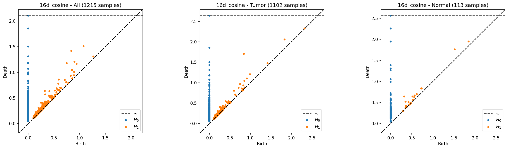
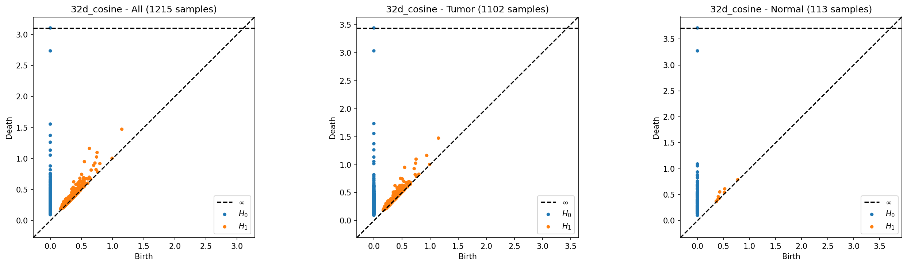
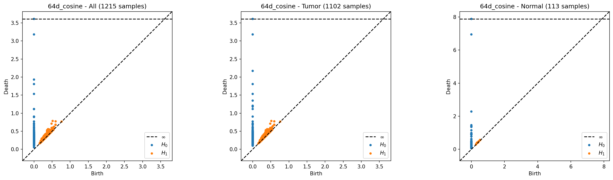
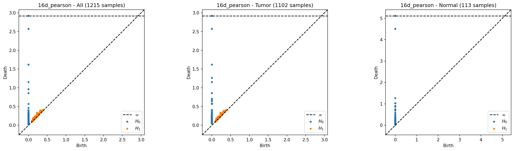
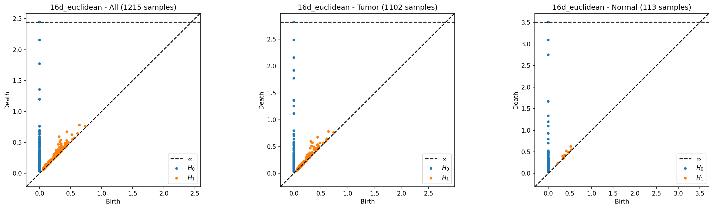
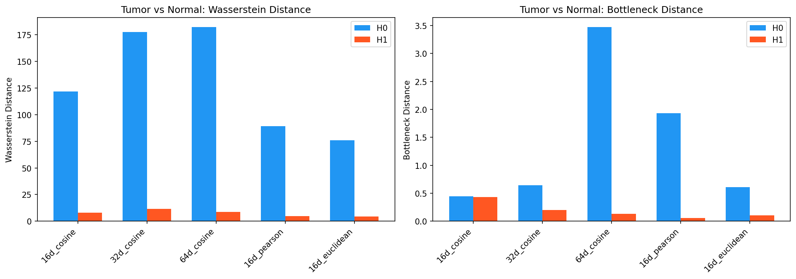

# Phase 1 분석 보고서: Persistent Homology 탐색적 분석

> **분석 일자**: 2026-04-02  
> **목적**: TAE latent 표현에서 종양(Tumor)과 정상(Normal) 조직 간 위상적(topological) 차이가 실제로 존재하는지 검증  
> **결론**: **종양과 정상 간 위상적 차이가 명확하게 존재하며, Phase 2(심층 분석) 진행 근거가 충분함**

---

## 1. 실험 설계

### 1.1 입력 데이터

| 항목 | 값 |
|------|-----|
| 데이터 출처 | TCGA-BRCA RNA-seq (GSE62944) |
| 전처리 | log1p → GPU ComBat 배치보정 → 유전자 필터링 |
| TAE 차원축소 | Topological Autoencoder (topo loss로 위상 구조 보존) |
| 분석 대상 | `TAE/results/latent/woutSMOTE/` (SMOTE 전 원본) |
| 총 샘플 수 | 1,215 (종양 1,102 + 정상 113) |

### 1.2 분석 설정

5가지 latent 표현을 비교 분석했습니다:

| 설정 | 차원 | TAE 학습 메트릭 | 파일 |
|------|------|----------------|------|
| **16d_cosine** | 16 | Cosine | `latent_16d_cosine.csv` |
| **32d_cosine** | 32 | Cosine | `latent_32d_cosine.csv` |
| **64d_cosine** | 64 | Cosine | `latent_64d_cosine.csv` |
| **16d_pearson** | 16 | Pearson | `latent_16d_pearson.csv` |
| **16d_euclidean** | 16 | Euclidean | `latent_16d_euclidean.csv` |

### 1.3 분석 방법

- **Vietoris-Rips Persistent Homology**: ripser 라이브러리를 사용하여 H0(연결 성분)과 H1(루프/구멍)을 계산
- **서브그룹 분석**: 전체, 종양만, 정상만으로 분리하여 각각 PH를 계산
- **정량적 비교**: Wasserstein distance와 Bottleneck distance로 종양/정상 간 persistence diagram의 차이를 측정

---

## 2. 핵심 결과

### 2.1 전체 결과 요약 테이블

| Latent 설정 | Homology | 종양 Feature 수 | 정상 Feature 수 | 종양 평균 Persistence | 정상 평균 Persistence | 종양 최대 Persistence | 정상 최대 Persistence | Wasserstein | Bottleneck |
|------------|----------|----------------|----------------|---------------------|---------------------|---------------------|---------------------|-------------|------------|
| 16d_cosine | H0 | 1,101 | 112 | 0.1916 | **0.3695** | 1.8537 | 2.2599 | 121.67 | 0.45 |
| 16d_cosine | H1 | **488** | 20 | 0.0239 | 0.0830 | **0.8661** | 0.3215 | 8.16 | 0.43 |
| 32d_cosine | H0 | 1,101 | 112 | 0.2673 | **0.3940** | 3.0316 | 3.2717 | 177.74 | 0.64 |
| 32d_cosine | H1 | **517** | 9 | 0.0328 | 0.0407 | **0.4037** | 0.1262 | 11.74 | 0.20 |
| 64d_cosine | H0 | 1,101 | 112 | 0.2689 | **0.4656** | 3.1805 | **6.9458** | 182.28 | **3.47** |
| 64d_cosine | H1 | **429** | 12 | 0.0294 | 0.0360 | 0.2701 | 0.0637 | 8.64 | 0.14 |
| 16d_pearson | H0 | 1,101 | 112 | 0.1327 | **0.2343** | 2.5721 | **4.5051** | 89.07 | 1.93 |
| 16d_pearson | H1 | **427** | **0** | 0.0153 | 0.0000 | 0.1105 | 0.0000 | 4.61 | 0.06 |
| 16d_euclidean | H0 | 1,101 | 112 | 0.1300 | **0.3461** | 2.4844 | 3.0919 | 76.11 | 0.61 |
| 16d_euclidean | H1 | **553** | 12 | 0.0120 | 0.0415 | 0.2776 | 0.1082 | 4.38 | 0.11 |

---

### 2.2 발견 1: 정상 조직은 더 뚜렷한 군집 구조를 가진다 (H0)

**H0 (연결 성분)** 분석에서 **모든 설정에 걸쳐 일관되게** 정상 조직의 평균 persistence가 종양보다 높았습니다.

```
정상 평균 persistence / 종양 평균 persistence (배율):

  16d_cosine:    0.370 / 0.192  = 1.93배
  32d_cosine:    0.394 / 0.267  = 1.47배
  64d_cosine:    0.466 / 0.269  = 1.73배
  16d_pearson:   0.234 / 0.133  = 1.76배
  16d_euclidean: 0.346 / 0.130  = 2.66배
```

**해석**: Persistence가 높다는 것은 데이터 포인트들이 잘 분리된 군집(cluster)을 형성하고, 그 군집이 더 넓은 스케일 범위에서 유지된다는 의미입니다.

- **정상 조직**: 유전자 발현 패턴이 명확한 군집을 형성 → 조직별/기능별로 잘 조직화된 상태
- **종양 조직**: 군집 구조가 약하고 빠르게 합쳐짐 → 유전자 발현이 탈규제(deregulated)되어 경계가 흐려진 상태

이는 암의 **유전적 이질성(genetic heterogeneity)** — 종양 세포들이 다양한 돌연변이를 축적하면서 균일한 발현 패턴을 잃어버리는 현상 — 과 일치하는 위상적 시그니처입니다.

---

### 2.3 발견 2: 종양에만 풍부한 루프 구조 (H1)

**H1 (루프/1차원 구멍)** 분석에서 극적인 차이가 관찰되었습니다.

```
종양 H1 Feature 수 / 정상 H1 Feature 수:

  16d_cosine:    488 / 20   = 24.4배
  32d_cosine:    517 / 9    = 57.4배
  64d_cosine:    429 / 12   = 35.8배
  16d_pearson:   427 / 0    = ∞ (정상에 H1 없음!)
  16d_euclidean: 553 / 12   = 46.1배
```

특히 **16d_pearson 설정에서 정상 조직의 H1 feature가 0개**라는 점이 주목할 만합니다. 이는 정상 조직의 latent 표현에는 루프 구조가 전혀 존재하지 않음을 의미합니다.

**해석**: H1 루프는 데이터 공간에서 "구멍이 뚫린" 원형 구조를 나타냅니다.

- **종양의 풍부한 루프**: 종양 세포들이 유전자 발현 공간에서 **비선형적 순환 경로(cyclic pathway)** 를 형성함을 시사합니다. 이는 다음과 같은 생물학적 현상과 연결될 수 있습니다:
  - 세포주기(cell cycle) 상태의 혼재
  - 상피-중간엽 전환(EMT) 스펙트럼
  - 종양 내 아형(subtype) 간 연속적 전이
- **정상의 단순한 구조**: 정상 세포들은 안정적이고 단순한 위상 구조를 가짐 → 세포 상태가 잘 정의되고 전이가 적음

**이 발견이 중요한 이유**: 기존 유클리드 분석(T-test, 상관관계)에서는 이러한 "루프" 구조를 포착할 수 없습니다. T-test는 평균의 차이만, 상관관계는 선형 관계만을 측정합니다. **비선형 순환 구조는 TDA만이 감지할 수 있는 특징**입니다.

---

### 2.4 발견 3: Cosine 메트릭이 위상적 차이를 가장 잘 포착한다

Wasserstein distance(두 persistence diagram 간 "운반 비용") 기준으로 메트릭을 비교하면:

```
H0 Wasserstein distance (종양 vs 정상):

  16d_cosine:    121.67  ← 높음
  32d_cosine:    177.74  ← 가장 높음
  64d_cosine:    182.28  ← 가장 높음
  16d_pearson:    89.07
  16d_euclidean:  76.11  ← 가장 낮음

H1 Wasserstein distance:

  32d_cosine:     11.74  ← 가장 높음
  64d_cosine:      8.64
  16d_cosine:      8.16
  16d_pearson:     4.61
  16d_euclidean:   4.38  ← 가장 낮음
```

**Cosine 메트릭이 H0, H1 모두에서 가장 큰 Wasserstein distance**를 기록했습니다. 이는 TAE 학습 시에도 cosine이 유전자 발현 데이터의 구조를 가장 잘 포착한다는 관찰과 일치합니다.

**이유**: RNA-seq 유전자 발현 데이터에서 절대적 발현량보다 **유전자 간 상대적 비율(방향)**이 생물학적으로 더 의미 있기 때문입니다. Cosine distance는 바로 이 방향성을 측정합니다.

---

### 2.5 발견 4: 차원이 높아질수록 H0 차이는 커지고 H1 차이는 안정적

Cosine 메트릭 내에서 차원(16d → 32d → 64d)에 따른 변화:

```
H0 Wasserstein:  121.67 → 177.74 → 182.28  (차원↑ → 차이↑)
H1 Wasserstein:    8.16 →  11.74 →   8.64  (32d에서 피크)

H0 Bottleneck:     0.45 →   0.64 →   3.47  (64d에서 급증)
H1 Bottleneck:     0.43 →   0.20 →   0.14  (차원↑ → 차이↓)
```

**해석**:
- **H0**: 고차원으로 갈수록 연결 성분의 차이가 커짐 → 더 많은 정보가 보존되면서 군집 구조 차이가 더 선명해짐
- **H1**: 32d에서 Wasserstein이 피크 → 루프 구조를 포착하기에 적절한 차원이 존재함. 너무 높은 차원은 희소성(sparsity) 문제로 루프 감지가 어려워질 수 있음

**권장**: Phase 2 심층 분석에서는 **32d_cosine**을 주 분석 대상으로, 16d_cosine과 64d_cosine을 보조 비교군으로 사용하는 것이 적절합니다.

---

## 3. Persistence Diagram 시각적 비교

### 3.1 16d_cosine



- **종양(가운데)**: H1(주황) 점이 대각선 위로 넓게 분포 → 다양한 스케일의 루프 존재
- **정상(오른쪽)**: H1 점이 거의 없고, H0(파랑) 점 중 대각선에서 먼 점이 다수 → 뚜렷한 군집

### 3.2 32d_cosine



- 종양의 H1 feature가 더 밀집되어 있으며, 대각선 근처에 집중 → 작은 스케일의 루프가 매우 많음
- 정상의 H0에서 대각선에서 먼 점들이 명확 → 군집이 더 분리되어 있음

### 3.3 64d_cosine



- 정상의 H0에서 **Death = ~7.0** 수준의 극단적으로 오래 지속되는 연결 성분 존재 → 매우 강한 군집 분리
- 종양에서는 그러한 극단값이 없음

### 3.4 16d_pearson



- **정상에서 H1 feature가 완전히 0개** — 가장 극적인 차이
- 종양의 H0 분포도 대각선에 매우 가깝게 밀집 → 군집이 약함

### 3.5 16d_euclidean



- 종양의 H1이 가장 많지만(553개), 대부분 대각선에 매우 가까움 → 수명이 짧은 노이즈성 루프
- 정상의 H0에서 대각선에서 먼 점이 관찰됨

---

## 4. 거리 비교 차트



- **왼쪽 (Wasserstein)**: 종양/정상 간 persistence diagram의 "총 운반 비용". H0(파랑)가 모든 설정에서 H1(빨강)보다 압도적으로 큼 → 연결 성분 구조의 차이가 가장 큰 위상적 시그널
- **오른쪽 (Bottleneck)**: 가장 차이가 큰 단일 feature 기준. 64d_cosine의 H0에서 3.47로 급증 → 정상에만 존재하는 극단적으로 오래 지속되는 군집이 있음

---

## 5. 기존 유클리드 분석과의 비교

Phase 1의 TDA 결과를 이전에 완료한 유클리드 분석(`data_analysis/`)과 대조하면:

| 분석 방법 | 발견할 수 있는 것 | 발견한 것 |
|-----------|-----------------|----------|
| **T-test** | 개별 유전자의 평균 차이 | EGFR(FC=0.41), GATA3(FC=3.17) 등 개별 유전자 |
| **Point-biserial** | 단일 유전자와 종양 상태의 선형 상관 | EGFR(-0.477), BRCA2(+0.269) |
| **Chi-square** | 범주형 변수 간 연관성 | TSS와 종양 상태의 강한 연관(V=0.458) |
| **TDA (Phase 1)** | 다변량 비선형 구조 차이 | **종양의 루프 구조, 정상의 군집 분리, 순환적 세포 상태** |

**TDA만이 발견할 수 있었던 것**:
1. 종양 데이터에 수백 개의 루프 구조가 존재한다는 사실 (H1)
2. 정상 조직이 더 뚜렷한 군집을 형성한다는 사실 (H0 persistence)
3. 이러한 차이가 어떤 메트릭/차원에서 가장 극대화되는지 (cosine, 32d)

이들은 단변량 통계로는 원리적으로 포착이 불가능한 **다변량 위상적 특성**입니다.

---

## 6. 한계점 및 주의사항

1. **정상 샘플 수 불균형**: 정상 113개 vs 종양 1,102개. 샘플 수 차이 자체가 PH feature 수에 영향을 줄 수 있음 (포인트가 적으면 루프가 덜 생김). Phase 2에서 bootstrap 리샘플링으로 이 효과를 통제해야 함.

2. **Wasserstein distance의 샘플 크기 의존성**: feature 수가 다르면 Wasserstein distance 자체가 커질 수 있음. 정규화된 비교가 필요할 수 있음.

3. **통계적 유의성 미검증**: 현재는 관찰된 차이가 우연인지 아닌지를 검증하지 않았음. Phase 2에서 permutation test를 통해 p-value를 산출해야 함.

4. **H2 미분석**: 계산 비용 고려로 H2(2차원 빈 공간)는 분석하지 않았음. 필요 시 추가 가능.

---

## 7. 결론 및 다음 단계

### 결론

> TCGA-BRCA 데이터의 TAE latent 표현에서 **종양과 정상 조직 간 위상적 차이가 명확하게 존재**합니다.
> 
> 특히 종양에서만 관찰되는 **풍부한 H1 루프 구조**는 기존 유클리드 분석으로는 감지할 수 없는 고유한 위상적 시그니처이며, 이는 종양의 유전적 이질성 및 비선형 세포 상태 전이를 반영하는 것으로 해석됩니다.

### Phase 2 진행 근거

| 기준 | 충족 여부 | 근거 |
|------|----------|------|
| 위상적 차이 존재 | **충족** | 5개 설정 모두에서 H0, H1 차이 일관 |
| 메트릭 간 일관성 | **충족** | cosine > pearson > euclidean 순서로 일관 |
| 차원 간 일관성 | **충족** | 16d, 32d, 64d 모두에서 동일한 패턴 |
| 유클리드 분석 대비 부가가치 | **충족** | H1 루프 구조는 TDA 고유 발견 |

### 다음 단계 (Phase 2)

1. **Bootstrap 기반 통계 검증**: 정상 샘플을 반복 리샘플링하여 관찰된 차이의 유의성 검증
2. **Permutation test**: 종양/정상 라벨을 셔플하여 Wasserstein distance의 null distribution 생성
3. **최적 설정 확정**: 32d_cosine을 주 분석 대상으로 확정
4. **Phase 3 준비**: persistence feature → latent dimension → 유전자 역추적 파이프라인 설계

---

## 부록: 실행 환경

| 항목 | 값 |
|------|-----|
| Python | 3.12.13 (conda: tda) |
| ripser | 0.6.14 |
| persim | 0.3.8 |
| gudhi | 3.12.0 |
| numpy | 2.4.4 |
| pandas | 3.0.2 |
| OS | Windows 11 Pro |
| 스크립트 | `phase1_tda_setup/explore_ph.py` |
| 총 실행 시간 | ~5초 (모든 설정 포함) |
