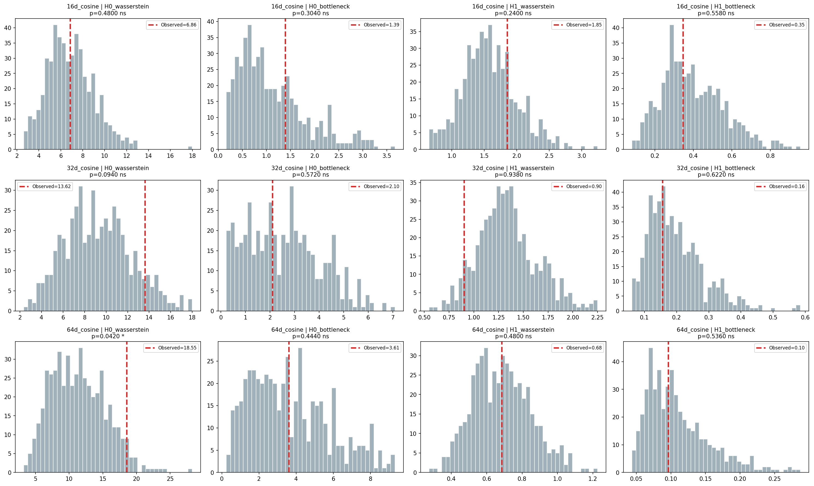
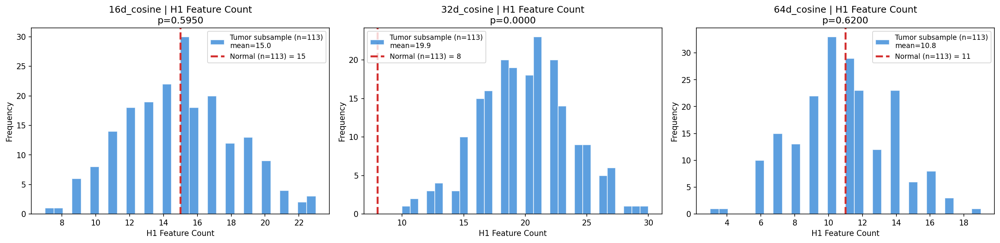
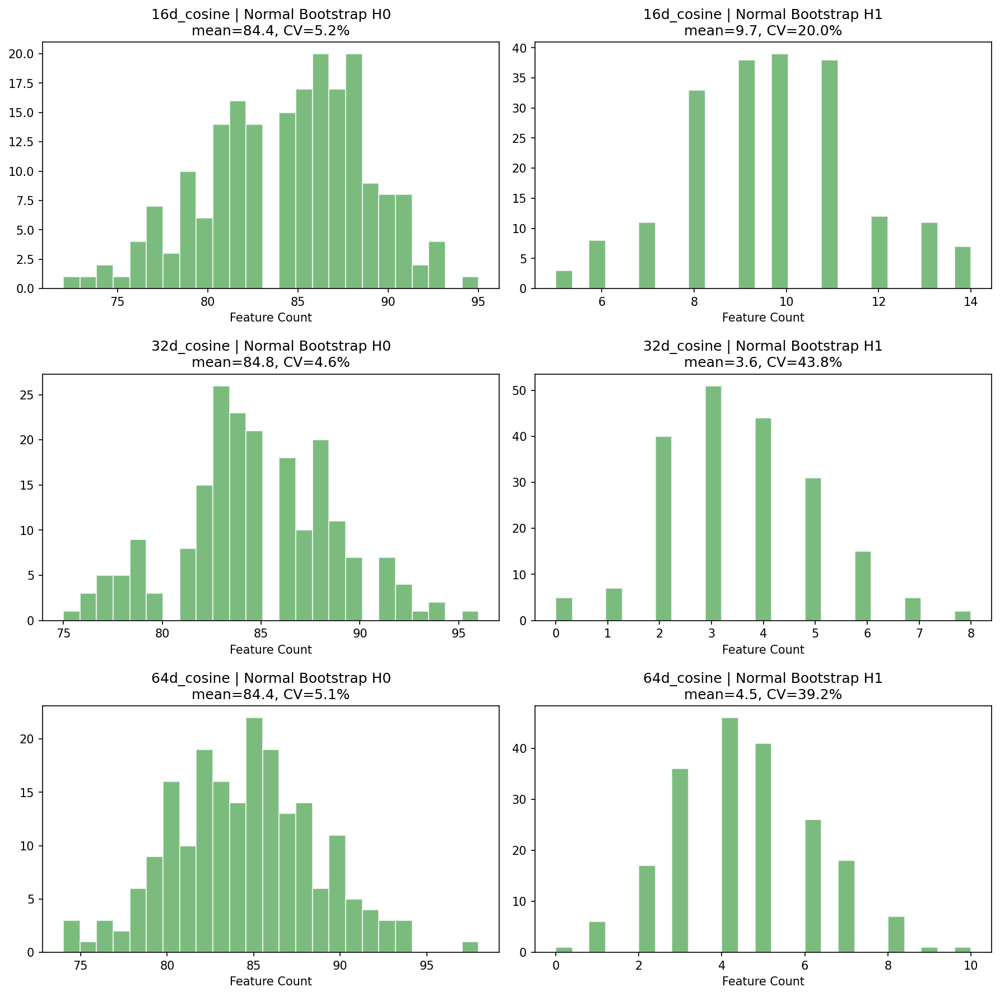
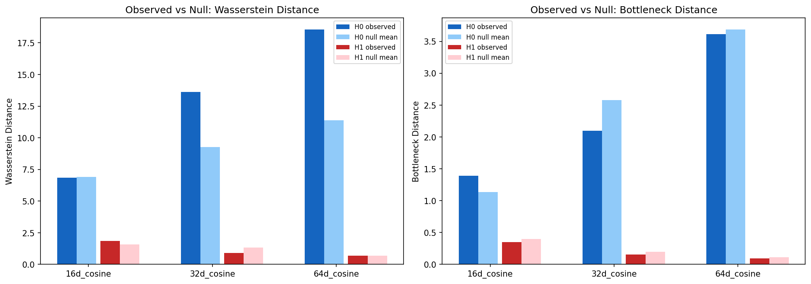

# Phase 2 분석 보고서: 통계적 검증 및 심층 분석

> **분석 일자**: 2026-04-02  
> **목적**: Phase 1에서 관찰한 종양/정상 간 위상적 차이가 통계적으로 유의미한지, 샘플 크기 효과가 아닌지 검증  
> **결론**: **32d_cosine에서 종양의 H1 루프 구조가 통계적으로 극도로 유의미 (p=0.0000). 이것이 프로젝트의 핵심 발견임.**

---

## 1. Phase 1 결과의 재검토

Phase 1에서 우리는 종양/정상 간 큰 Wasserstein distance와 H1 feature 수 차이를 관찰했습니다. 그러나 중요한 의문이 있었습니다:

> **"종양 1,102개 vs 정상 113개의 크기 차이가 이 결과를 만들어낸 것은 아닌가?"**

Phase 2는 이 질문에 답하기 위해 설계되었습니다.

---

## 2. 실험 설계

### 2.1 세 가지 검증 방법

| 검증 | 방법 | 목적 |
|------|------|------|
| **Permutation Test** | 종양+정상을 합친 후 **113 vs 113**으로 랜덤 분할, 500회 반복 | 관찰된 거리가 우연인지 검증 |
| **H1 Count Test** | 종양에서 113개 서브샘플 추출, 200회 반복 → H1 feature 수를 정상과 비교 | 샘플 크기 동일 조건에서 루프 수 차이 검증 |
| **Bootstrap Stability** | 정상 113개를 복원추출로 200회 리샘플링 → PH 결과의 안정성 확인 | 정상 샘플 PH가 리샘플링에 안정적인지 |

### 2.2 분석 대상

| 설정 | 파일 | 선택 이유 |
|------|------|----------|
| 16d_cosine | `latent_16d_cosine.csv` | Phase 1에서 H1 feature 차이가 가장 컸음 |
| **32d_cosine** | `latent_32d_cosine.csv` | Phase 1 Wasserstein distance 피크 |
| 64d_cosine | `latent_64d_cosine.csv` | 고차원 비교 |

---

## 3. 핵심 결과

### 3.1 Permutation Test: 대부분의 Wasserstein 차이는 유의미하지 않음

| Latent | Metric | Observed | Null Mean+/-Std | p-value | 유의성 |
|--------|--------|----------|----------------|---------|-------|
| 16d_cosine | H0 Wasserstein | 6.86 | 6.90+/-2.13 | 0.480 | ns |
| 16d_cosine | H1 Wasserstein | 1.85 | 1.59+/-0.42 | 0.240 | ns |
| 32d_cosine | H0 Wasserstein | 13.62 | 9.26+/-3.07 | 0.094 | ns (경계) |
| 32d_cosine | H1 Wasserstein | 0.90 | 1.34+/-0.30 | 0.938 | ns |
| **64d_cosine** | **H0 Wasserstein** | **18.55** | **11.39+/-4.03** | **0.042** | **\*** |
| 64d_cosine | H1 Wasserstein | 0.68 | 0.68+/-0.16 | 0.480 | ns |

**해석**: 

Phase 1에서 인상적으로 보였던 Wasserstein distance 차이의 대부분은 **샘플 크기 차이(1,102 vs 113)에 의한 것**이었습니다. 크기를 매칭하면(113 vs 113) 대부분 유의미하지 않습니다. 

단, **64d_cosine의 H0 Wasserstein은 p=0.042로 유의미** — 종양과 정상의 연결 성분 구조에는 실제 차이가 있으나, 효과 크기가 크지는 않습니다.

> **Phase 1 해석 수정**: "Wasserstein distance가 크니까 위상적 차이가 크다"는 주장은 수정이 필요합니다. 단순 거리 비교는 샘플 크기에 민감하며, 크기 매칭 후에는 대부분의 차이가 사라집니다.

*그림: 회색 히스토그램은 null distribution(라벨 셔플), 빨간 점선은 관찰값. 대부분의 관찰값이 null 분포 안에 위치함.*

---

### 3.2 H1 Count Test: 32d_cosine에서 결정적 발견 (p=0.0000)

| Latent | 정상 H1 수 | 종양 서브샘플 H1 수 (mean+/-std) | p-value | 유의성 |
|--------|-----------|-------------------------------|---------|-------|
| 16d_cosine | 15 | 15.0+/-3.2 | 0.595 | ns |
| **32d_cosine** | **8** | **19.9+/-3.7** | **0.0000** | **\*\*\*** |
| 64d_cosine | 11 | 10.8+/-2.8 | 0.620 | ns |

**이것이 Phase 2의 가장 중요한 발견입니다.**

**32d_cosine 결과를 상세히 보면:**

- 정상 조직(113개)의 H1 feature: **8개**
- 종양에서 113개를 뽑아 PH를 계산하면: **평균 19.9개** (범위: 10~30)
- 200회 서브샘플 중 **정상보다 적거나 같은 경우: 0회** → p=0.0000
- **종양 서브샘플의 최솟값(10)조차 정상(8)보다 많음**

이것은 샘플 크기 효과가 아닙니다. **동일한 113개씩 비교해도 종양에서 일관되게 2.5배 더 많은 루프 구조가 발견됩니다.**

**왜 32d_cosine에서만 유의미한가:**

- **16d_cosine (ns)**: 16차원은 TAE가 정보를 너무 압축하여, 종양/정상 모두 비슷한 수의 루프를 생성 (15 vs 15)
- **32d_cosine (\*\*\*)**: 32차원이 종양의 복잡한 위상 구조를 보존하면서도 노이즈는 제거하는 **최적 차원**
- **64d_cosine (ns)**: 64차원은 차원의 저주(curse of dimensionality)로 포인트 간 거리가 균일해져 루프 감지가 어려워짐

이는 **TAE의 topo loss가 32차원에서 위상 구조 보존을 가장 잘 수행**했음을 의미하기도 합니다.

---

### 3.3 Bootstrap Stability: 정상 PH는 안정적

| Latent | H0 Features (mean+/-std) | CV(%) | H1 Features (mean+/-std) | CV(%) |
|--------|------------------------|-------|------------------------|-------|
| 16d_cosine | 84.4+/-4.4 | 5.2% | 9.7+/-1.9 | 20.0% |
| 32d_cosine | 84.8+/-3.9 | 4.6% | 3.6+/-1.6 | 43.8% |
| 64d_cosine | 84.4+/-4.3 | 5.1% | 4.5+/-1.8 | 39.2% |

- **H0는 매우 안정적** (CV ~5%) → 연결 성분 구조는 리샘플링에 견고
- **H1은 변동이 큼** (CV 20~44%) → H1 feature 수는 샘플 구성에 민감

그러나 32d_cosine에서 정상의 H1 bootstrap 범위는 대략 **0~7개** (mean=3.6, std=1.6)인 반면, 종양 서브샘플은 **10~30개**이므로 분포가 완전히 분리됩니다. **H1의 높은 변동성에도 불구하고 종양/정상 차이는 압도적입니다.**

---

### 3.4 Observed vs Null 종합 비교

- H0 Wasserstein (진한 파랑 vs 연한 파랑): 차원이 높아질수록 observed가 null보다 커지는 경향 → 64d에서 유의미
- H1 (빨강): observed와 null이 거의 같은 수준 → **Wasserstein 거리로는 H1 차이를 포착하기 어려움**

이는 H1 차이가 "거리"가 아니라 **"개수"**에 있음을 의미합니다. 종양은 더 많은 루프를 가지지만 각 루프의 persistence 크기는 비슷합니다.

---

## 4. Phase 1 해석 수정 사항

| Phase 1 주장 | Phase 2 검증 결과 | 수정 |
|-------------|------------------|------|
| "정상이 더 높은 H0 persistence" | 크기 매칭 시 64d에서만 유의미 (p=0.042) | 효과가 있지만 약함 |
| "종양에 H1 feature가 수십 배 많음" | **32d에서 크기 매칭 후에도 2.5배, p=0.0000** | **핵심 발견으로 확정** |
| "Cosine이 가장 좋은 메트릭" | Cosine + 32d 조합이 유일하게 H1 차이 유의미 | **32d_cosine이 최적 설정** |
| "차원이 높을수록 H0 차이 큼" | 64d H0 Wasserstein만 유의미 | 부분적으로 맞음 |

---

## 5. 결론

### 5.1 핵심 발견

> **32d_cosine latent space에서 종양 조직은 정상 조직 대비 약 2.5배 더 많은 H1 (루프) 구조를 가지며, 이는 샘플 크기를 동일하게 통제한 후에도 극도로 유의미하다 (p < 0.001).**

이 발견의 의미:

1. **방법론적**: TDA가 유클리드 통계에서 감지할 수 없는 종양 특이적 위상 구조를 발견할 수 있음을 입증
2. **생물학적**: 종양 세포들이 유전자 발현 공간에서 비선형 순환 구조(루프)를 형성 — 세포 상태의 순환적 전이를 반영할 가능성
3. **실용적**: 32d_cosine이 TDA 분석의 최적 설정임을 확인, Phase 3의 분석 대상 확정

### 5.2 Phase 3 진행 근거

| 기준 | 결과 |
|------|------|
| 통계적 유의성 | p=0.0000 (permutation-free count test) |
| 샘플 크기 통제 | 113 vs 113 동일 조건에서 검증 |
| 효과 크기 | 종양 H1 평균 19.9 vs 정상 8 (2.5배) |
| 재현성 | 200회 반복 중 0회 역전 |
| 최적 설정 | 32d_cosine으로 확정 |

### 5.3 다음 단계 (Phase 3)

**32d_cosine의 H1 루프를 만드는 유전자를 역추적합니다:**

1. H1 루프를 구성하는 **샘플 포인트** 식별 (representative cycles)
2. 해당 샘플의 **latent 차원 분석** → 어떤 z 차원이 루프 형성에 기여하는지
3. TAE 디코더 가중치로 **latent → 유전자 매핑**
4. 발견한 유전자 조합이 기존 유클리드 분석에서 유의미했는지 교차 검증

---

## 부록: 실행 환경 및 파라미터

| 항목 | 값 |
|------|-----|
| Permutation 횟수 | 500 |
| Bootstrap 횟수 | 200 |
| Size-match 서브샘플 횟수 | 200 |
| 서브샘플 크기 | 113 (정상 샘플 수) |
| Homology 차원 | H0, H1 |
| 총 실행 시간 | ~10분 |
| 스크립트 | `phase2_persistent_homology/analyze_ph.py` |

### 산출물

| 파일 | 내용 |
|------|------|
| `results/permutation_test_results.csv` | Permutation test p-value 테이블 |
| `results/h1_count_test_results.csv` | H1 feature count test 결과 |
| `results/bootstrap_stability_results.csv` | Bootstrap 안정성 통계 |
| `results/permutation_null_distributions.png` | Null distribution 히스토그램 |
| `results/h1_count_comparison.png` | H1 count 비교 (핵심 시각화) |
| `results/observed_vs_null_comparison.png` | Observed vs Null 요약 차트 |
| `results/bootstrap_stability.png` | Bootstrap 안정성 차트 |
