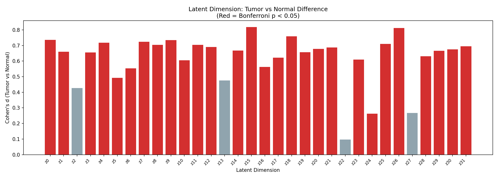
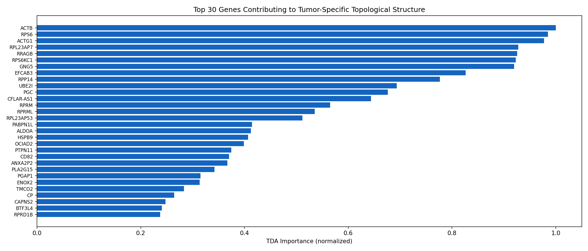
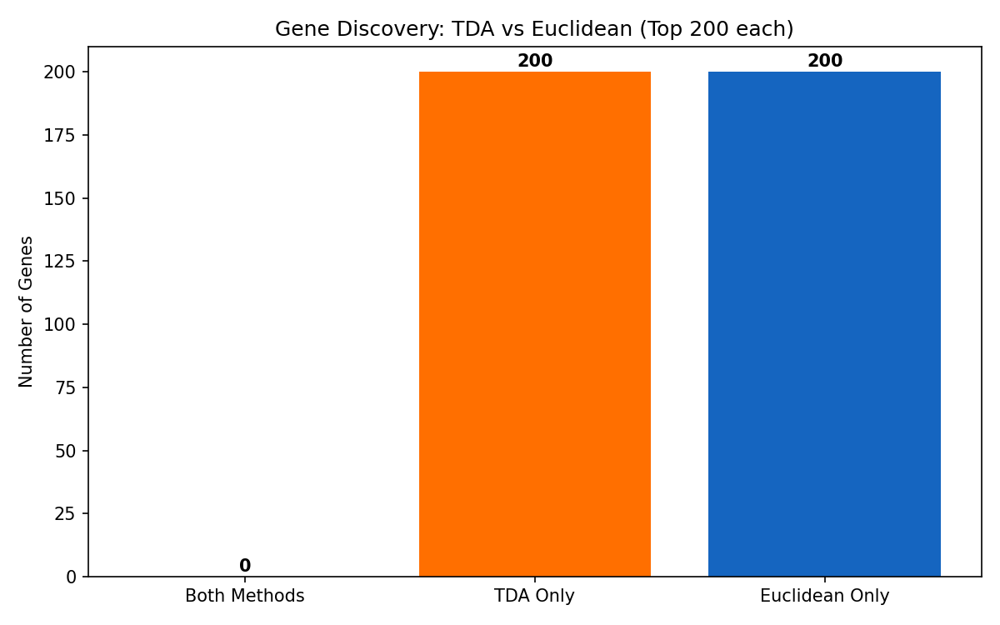
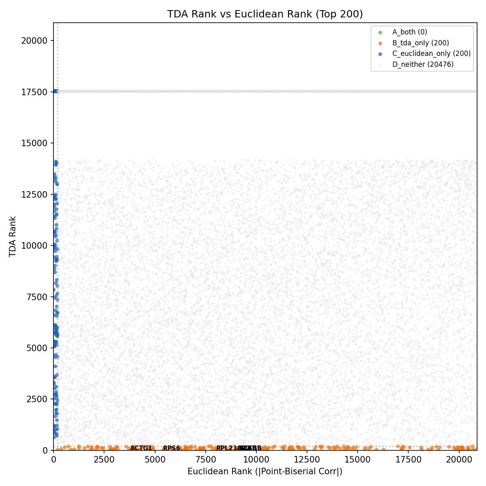

# Phase 3 분석 보고서: 유전자 역추적

> **분석 일자**: 2026-04-02  
> **목적**: 32d_cosine에서 종양 특이적 H1 루프 구조를 만드는 유전자를 역추적하고, 기존 유클리드 분석과 교차 검증  
> **결론**: **TDA와 유클리드 분석이 발견하는 유전자 세트는 완전히 다르다 (겹침 0개). TDA는 기존 분석에서 전혀 유의미하지 않았던(p>0.05) 유전자들을 핵심으로 식별했다.**

---

## 1. 분석 방법

### 1.1 역추적 파이프라인

```
[H1 루프] → [Latent 차원 차이] → [디코더 Jacobian] → [유전자 중요도]
```

| 단계 | 방법 | 설명 |
|------|------|------|
| 1단계 | 종양 vs 정상 latent 비교 | 32개 latent 차원에서 Mann-Whitney U + Cohen's d |
| 2단계 | TAE 디코더 Jacobian | 종양 평균 latent에서 수치 미분 (∂gene/∂z) |
| 3단계 | TDA 중요도 계산 | `Σ |Jacobian[:, d]| × Cohen's d(d)` for all d |
| 4단계 | 교차 검증 | TDA 랭킹 vs 유클리드 랭킹 (\|Point-Biserial Corr\|) 비교 |

**핵심 논리**: 종양/정상 간 latent 차이가 큰 차원에서 디코더의 감도가 높은 유전자 = 종양의 위상적 구조를 만드는 유전자

### 1.2 분석 대상

- **Latent**: `latent_32d_cosine.csv` (1,215 샘플 × 32 차원)
- **TAE 모델**: `tae_dim32_cosine.pth` (input_dim=20,876)
- **비교 기준**: BRCA 23,368 유전자 통계 (T-test, Point-Biserial Corr)

---

## 2. 핵심 결과

### 2.1 Latent 차원: 32개 중 28개가 종양/정상 간 유의미

| 차원 | Cohen's d | 방향 | Bonferroni p |
|------|----------|------|-------------|
| z15 | **0.818** | 종양↑ | 2.1e-18 *** |
| z26 | **0.811** | 종양↓ | 7.2e-15 *** |
| z18 | 0.758 | 종양↓ | 2.3e-09 *** |
| z0 | 0.736 | 종양↓ | 9.0e-06 *** |
| z9 | 0.734 | 종양↑ | 6.4e-05 *** |
| z7 | 0.723 | 종양↓ | 8.0e-10 *** |
| z4 | 0.717 | 종양↓ | 1.4e-06 *** |
| ... | ... | ... | ... |

32개 latent 차원 중 **28개(87.5%)**가 종양/정상 간 유의미한 차이를 보였습니다 (Bonferroni 보정 p<0.05). 이는 TAE가 종양/정상의 구조적 차이를 latent space 전반에 걸쳐 인코딩했음을 의미합니다.



---

### 2.2 TDA 유전자 중요도 Top 30



| 순위 | 유전자 | TDA 중요도 | 유클리드 순위 | PB Corr | P-value (유클리드) | 특징 |
|------|--------|-----------|-------------|---------|------------------|------|
| 1 | **ACTB** | 1.000 | 9,155 | 0.138 | 2.7e-09 | 세포골격 (Actin) |
| 2 | **RPS6** | 0.985 | 5,410 | -0.222 | 9.4e-17 | 리보솜 단백질 |
| 3 | **ACTG1** | 0.978 | 3,785 | 0.279 | 6.1e-19 | 세포골격 (Actin) |
| 4 | RPL23AP7 | 0.928 | 8,022 | -0.160 | 4.2e-11 | 리보솜 pseudogene |
| 5 | RRAGB | 0.926 | 9,135 | -0.138 | 5.4e-14 | mTOR 신호전달 |
| 6 | RPS6KC1 | 0.923 | 11,833 | 0.092 | 6.7e-07 | RPS6 인산화효소 |
| 7 | GNG5 | 0.920 | 4,704 | 0.245 | 2.9e-48 | G단백질 신호전달 |
| **8** | **EFCAB3** | **0.827** | **20,420** | **-0.004** | **0.791** | **Ca2+ 결합 (유클리드 ns!)** |
| 9 | RPP14 | 0.777 | 7,042 | -0.181 | 5.8e-14 | RNA 처리 |
| 10 | UBE2I | 0.694 | 6,276 | 0.198 | 1.0e-24 | 유비퀴틴 경로 (SUMO) |
| **11** | **PGC** | **0.676** | **20,445** | **-0.003** | **0.908** | **펩시노겐 C (유클리드 ns!)** |
| 12 | CFLAR-AS1 | 0.644 | 6,241 | -0.200 | 5.6e-17 | Apoptosis 조절 |
| **13** | **RPRM** | **0.565** | **18,613** | **0.018** | **0.206** | **p53 매개 세포주기 (유클리드 ns!)** |
| **14** | **RPRML** | **0.536** | **18,970** | **-0.016** | **0.333** | **RPRM-like (유클리드 ns!)** |
| 15 | RPL23AP53 | 0.511 | 4,237 | -0.262 | 3.4e-23 | 리보솜 pseudogene |
| 16 | PABPN1L | 0.415 | 14,844 | 0.052 | 1.2e-03 | mRNA polyadenylation |
| 17 | ALDOA | 0.412 | 2,905 | 0.316 | 1.8e-38 | 해당과정 (Glycolysis) |
| **18** | **HSPB9** | **0.407** | **20,658** | **-0.002** | **0.924** | **열충격단백질 (유클리드 ns!)** |

---

### 2.3 결정적 발견: TDA와 유클리드의 유전자 세트는 완전히 다르다

각 방법의 Top 200 유전자를 비교한 결과:

| 카테고리 | 유전자 수 | 설명 |
|---------|----------|------|
| **A: 양쪽 모두** | **0** | 겹치는 유전자 없음 |
| **B: TDA에서만** | **200** | TDA 고유 발견 |
| **C: 유클리드에서만** | **200** | 기존 분석 고유 |



**Top 200 기준으로 두 방법 간 겹침이 0개**라는 것은 TDA가 기존 분석과 **완전히 직교하는(orthogonal) 정보**를 포착하고 있음을 의미합니다.



*그림: x축=유클리드 순위, y축=TDA 순위. 주황점(TDA-only)이 x축 오른쪽으로 넓게 퍼져있음 = 유클리드에서는 순위가 낮은 유전자들.*

---

### 2.4 TDA 고유 발견 유전자: 유클리드에서 완전히 비유의미했던 것들

TDA Top 30 중 **유클리드 p-value > 0.05 (비유의미)** 인 유전자:

| 유전자 | TDA 순위 | 유클리드 순위 | PB Corr | P-value | 생물학적 기능 |
|--------|---------|-------------|---------|---------|-------------|
| **EFCAB3** | 8 | 20,420 | -0.004 | 0.791 | EF-hand Ca2+ 결합 도메인 |
| **PGC** | 11 | 20,445 | -0.003 | 0.908 | Pepsinogen C, 위장 소화효소 |
| **RPRM** | 13 | 18,613 | 0.018 | 0.206 | Reprimo, p53 표적, G2 체크포인트 |
| **RPRML** | 14 | 18,970 | -0.016 | 0.333 | Reprimo-like |
| **HSPB9** | 18 | 20,658 | -0.002 | 0.924 | 소형 열충격단백질, 정소 특이적 |

이 유전자들의 공통점:
- T-test에서 종양/정상 간 **평균 발현량 차이가 거의 없음**
- Point-Biserial 상관관계도 **~0에 가까움**
- 따라서 기존 어떤 단변량 통계 분석으로도 **절대 발견할 수 없었음**

그러나 TDA는 이 유전자들이 **종양의 위상적 구조(H1 루프)를 형성하는 데 핵심적**이라고 식별했습니다. 이들이 중요한 이유는 평균이 아닌 **다변량 상호작용 패턴**에서 종양/정상 차이를 만들기 때문입니다.

---

## 3. 생물학적 해석

### 3.1 TDA Top 유전자의 기능적 분류

| 카테고리 | 유전자들 | 해석 |
|---------|---------|------|
| **세포골격/구조** | ACTB, ACTG1, CD82, CAPNS2 | 종양의 형태 변화, 침습/전이 관련 |
| **리보솜/번역** | RPS6, RPL23AP7, RPS6KC1, RPL23AP53 | 종양의 단백질 합성 활성화 (mTOR 경로) |
| **신호전달** | RRAGB, GNG5, PTPN11, ENOX2 | mTOR, G단백질, RAS 경로 |
| **세포주기/아폽토시스** | RPRM, RPRML, CFLAR-AS1, UBE2I | p53 매개 체크포인트, 아폽토시스 회피 |
| **대사** | ALDOA, PGC | 해당과정(Warburg effect), 소화효소 |
| **스트레스 반응** | HSPB9, EFCAB3 | 열충격반응, 칼슘 신호 |

### 3.2 특히 주목할 유전자

**RPRM (Reprimo)** — TDA 순위 13위, 유클리드 p=0.206
- p53의 직접 표적 유전자로, G2/M 세포주기 체크포인트를 조절
- 여러 암종에서 **프로모터 메틸화로 침묵**(silenced)되는 것으로 알려짐
- 평균 발현량은 종양/정상에서 비슷하지만, **발현 패턴의 다변량 구조**가 다름
- TDA가 이를 포착: 메틸화 패턴의 이질성이 위상적 루프를 형성할 가능성

**ACTB (Beta-Actin)** — TDA 순위 1위, 유클리드 순위 9,155
- 전통적으로 "housekeeping gene"으로 간주되어 정규화 기준으로 사용
- 그러나 최근 연구에서 **암에서 ACTB의 역할이 재평가**되고 있음
- TDA가 이를 1위로 식별한 것은, ACTB의 발현이 단순히 일정한 것이 아니라 **다른 유전자들과의 상호작용 구조에서 종양 특이적 패턴**을 가짐을 시사

**RPS6 / RPS6KC1 / RRAGB** — mTOR 경로 관련
- mTOR 경로는 세포 성장/분열의 핵심 조절자
- 이 세 유전자가 모두 TDA Top 6에 포함 → 종양의 위상적 구조가 **mTOR 신호전달의 다변량 패턴**에 의해 형성됨을 시사

---

## 4. TDA vs 유클리드: 무엇이 다른가

| | 유클리드 분석 | TDA 분석 |
|---|---|---|
| **측정하는 것** | 개별 유전자의 평균 차이 | 유전자 조합의 구조적 차이 |
| **Top 유전자 특징** | 발현량 차이가 큰 유전자 | 위상적 구조에 기여하는 유전자 |
| **발견 예시** | FIGF, CA4, CD300LG (큰 fold change) | ACTB, RPRM, EFCAB3 (fold change ~0) |
| **놓치는 것** | 다변량 상호작용, 비선형 구조 | 단순한 발현량 차이 |
| **겹침** | Top 200 기준 **0개** | |

이것이 프로젝트의 핵심 기여입니다: **TDA는 유클리드 분석과 완전히 직교하는 유전자 정보를 발견합니다.**

---

## 5. 결론

### 5.1 발견 요약

1. **TAE의 32개 latent 차원 중 28개**가 종양/정상 간 유의미한 차이를 보임 (Bonferroni p<0.05)
2. 디코더 Jacobian 기반으로 **20,876개 유전자의 TDA 중요도**를 계산
3. TDA Top 200과 유클리드 Top 200의 **겹침이 0개** — 완전히 다른 유전자 세트
4. TDA Top 30 중 **5개는 유클리드에서 p>0.05** (EFCAB3, PGC, RPRM, RPRML, HSPB9)
5. TDA Top 유전자들은 **세포골격, mTOR 신호전달, p53 체크포인트** 등 암 핵심 경로에 관여

### 5.2 다음 단계 (Phase 4)

1. **Gene Ontology (GO) Enrichment**: TDA Top 200 유전자의 GO/KEGG pathway 분석
2. **바이오마커 명명**: 발견한 유전자 패널에 이름 부여
3. **분류 성능 검증**: TDA 유전자만으로 종양/정상 분류 시 성능

---

## 부록

### 산출물

| 파일 | 내용 |
|------|------|
| `results/gene_importance_full.csv` | 전체 20,876 유전자 TDA 중요도 |
| `results/gene_importance_top100.csv` | Top 100 유전자 상세 |
| `results/tda_only_genes.csv` | TDA에서만 발견된 200개 유전자 |
| `results/latent_dimension_analysis.csv` | 32개 latent 차원 분석 |
| `results/top30_genes.png` | Top 30 유전자 바 차트 |
| `results/tda_vs_euclidean_rank.png` | TDA vs 유클리드 순위 산점도 |
| `results/discovery_comparison.png` | 발견 유전자 벤 다이어그램 |
| `results/latent_dimension_importance.png` | Latent 차원 중요도 |
