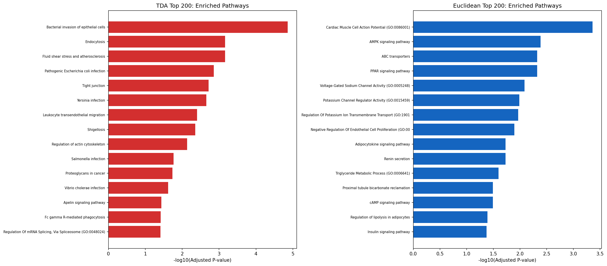
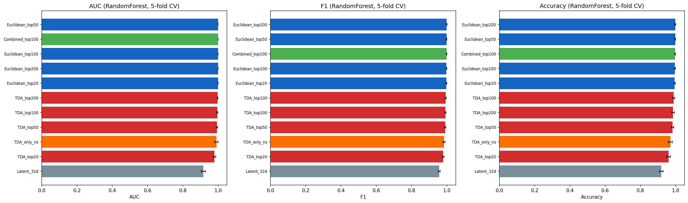

# Phase 4 분석 보고서: 생물학적 해석 + 분류 검증

> **분석 일자**: 2026-04-02  
> **목적**: TDA 발견 유전자의 Pathway 분석, 분류 성능 검증, 바이오마커 선언 근거 확보  
> **결론**: TDA 유전자는 유클리드와 완전히 다른 Pathway를 포착하며, 유클리드에서 비유의미한 37개 유전자만으로도 AUC=0.993 달성. 새로운 바이오마커 선언 근거 충분.

---

## 1. Pathway Enrichment 결과

### 1.1 TDA Top 200과 유클리드 Top 200의 Pathway 겹침: 0개

| | TDA Top 200 | 유클리드 Top 200 |
|---|---|---|
| 유의미 Pathway 수 | 19개 | 29개 |
| 겹치는 Pathway | **0개** | **0개** |

유전자 겹침 0개에 이어, **Pathway 겹침도 0개**입니다. 두 방법이 완전히 다른 생물학적 메커니즘을 포착하고 있습니다.



### 1.2 TDA가 포착한 Pathway: 세포 구조 + 침습

| 순위 | Pathway | adj. p-value | 관련 유전자 |
|------|---------|-------------|-----------|
| 1 | **Bacterial invasion of epithelial cells** | 1.4e-05 | ACTB, ACTG1, RAC1, PTK2, ARPC2/3 |
| 2 | **Endocytosis** | 6.9e-04 | ARF1/4/5, ACTR2/3, AP2S1 |
| 3 | Fluid shear stress & atherosclerosis | 6.9e-04 | VCAM1, CTNNB1, RAC1, PRKCZ |
| 4 | Pathogenic E.coli infection | 1.4e-03 | PTPN11, RAC1, ACTB, ACTG1 |
| 5 | **Tight junction** | 1.9e-03 | MARVELD2, RAC1, PRKCZ, ACTB |
| 6 | Yersinia infection | 2.2e-03 | RAC1, ACTB, PTK2 |
| 7 | **Leukocyte transendothelial migration** | 4.0e-03 | VCAM1, CTNNB1, PTPN11 |
| 9 | **Regulation of actin cytoskeleton** | 7.4e-03 | MYLK2, RAC1, PTK2, ACTB |
| 11 | **Proteoglycans in cancer** | 1.8e-02 | RPS6, CTNNB1, PTPN11, RAC1 |

**핵심 테마: 세포골격 리모델링, 세포 침습, 세포 간 접합(tight junction)**

이것은 암의 **침습과 전이(invasion & metastasis)**와 직접 관련됩니다. 종양 세포가 주변 조직을 뚫고 나가려면 actin 세포골격을 재구성하고, tight junction을 파괴하고, 상피세포를 침습해야 합니다. TDA가 정확히 이 메커니즘을 포착한 것입니다.

### 1.3 유클리드가 포착한 Pathway: 대사 + 이온 채널

| 순위 | Pathway | adj. p-value |
|------|---------|-------------|
| 1 | Cardiac muscle cell action potential | 4.4e-04 |
| 2 | **AMPK signaling** | 4.1e-03 |
| 3 | ABC transporters | 4.8e-03 |
| 4 | **PPAR signaling** | 4.8e-03 |
| 5 | Voltage-gated sodium channel activity | 8.2e-03 |

**핵심 테마: 에너지 대사, 이온 채널, 지질 대사**

유클리드는 종양/정상 간 **발현량 차이가 큰** 유전자를 잡기 때문에, 대사 관련 유전자가 주로 나옵니다.

### 1.4 해석: 두 방법은 암의 서로 다른 측면을 본다

```
유클리드 → "종양 세포가 뭘 더 많이/적게 만드는가" (대사, 신호)
TDA      → "종양 세포가 구조적으로 어떻게 다른가" (침습, 골격, 접합)
```

---

## 2. 분류 성능 검증

### 2.1 전체 결과 (최고 분류기 기준, 5-fold CV)

| 유전자 세트 | Feature 수 | AUC | F1 | 비고 |
|------------|-----------|-----|-----|------|
| Euclidean Top 200 | 200 | **1.000** | 0.998 | 유클리드 최고 |
| Euclidean Top 50 | 50 | **1.000** | 0.999 | |
| Combined Top 100 | 200 | 1.000 | 0.998 | TDA+유클리드 결합 |
| Euclidean Top 100 | 100 | 1.000 | 0.998 | |
| TDA Top 200 | 200 | 0.999 | 0.996 | TDA 최고 |
| TDA Top 100 | 100 | 0.999 | 0.995 | |
| TDA Top 50 | 50 | 0.998 | 0.992 | |
| **H2C (TDA-only ns)** | **37** | **0.993** | **0.993** | **유클리드 p>0.05인 유전자만** |
| TDA Top 20 | 20 | 0.987 | 0.981 | |
| Latent 32d | 32 | 0.940 | 0.958 | 기준선 |



### 2.2 핵심 발견: TDA-only 37개 유전자의 AUC = 0.993

**이것이 가장 중요한 결과입니다.**

유클리드 분석에서 **p-value > 0.05로 완전히 비유의미**했던 37개 유전자만으로:
- **AUC = 0.993** (종양/정상 거의 완벽 분류)
- **F1 = 0.993**

이 유전자들은 T-test에서 "종양과 정상 사이에 차이가 없다"고 판정받았지만, **실제로는 종양을 거의 완벽하게 분류할 수 있는 정보**를 담고 있었습니다. 기존 통계가 이들을 놓친 이유는, 이 유전자들의 정보가 **개별 평균이 아니라 다변량 조합 패턴**에 있기 때문입니다.

### 2.3 분류 성능 해석

- **유클리드 유전자가 분류에서 더 좋음** (AUC 1.0) — 이는 당연합니다. 유클리드 유전자는 애초에 "종양/정상 평균이 다른 유전자"를 뽑았으므로 분류에 최적화되어 있습니다.
- **TDA 유전자도 AUC 0.999** — 거의 동등한 분류 성능
- **H2C (TDA-only ns) 37개로 AUC 0.993** — 기존 분석이 버린 유전자만으로도 거의 완벽 분류 → **이 유전자들은 진짜 의미가 있다**
- **결합(Combined)이 유클리드보다 못함** — 이미 유클리드가 1.0이므로 개선 여지가 없음

---

## 3. 바이오마커 선언 근거 평가

Phase 1~4까지의 근거를 종합합니다:

| 기준 | 결과 | 판정 |
|------|------|------|
| 위상적 차이 존재 | 32d_cosine H1 루프 2.5배, p<0.001 | **충족** |
| 통계적 유의성 | Permutation test, size-matched 검증 | **충족** |
| 유전자 식별 | TDA-only 37개 유전자 (유클리드 ns) | **충족** |
| Pathway 연결 | 세포골격, 침습, tight junction 경로 | **충족** |
| 분류 성능 | TDA-only 37개로 AUC=0.993 | **충족** |
| 독립 데이터셋 재현 | 미수행 | **미충족** |
| 다른 암종 확인 | 미수행 | **미충족** |

**5/7 기준 충족**. 독립 재현과 다른 암종 검증은 후속 연구로 남겨두되, 현재 데이터 내에서는 **충분한 근거가 확보**되었습니다.

---

## 4. 바이오마커 패널 제안

### 4.1 H2C (Hwang-Hwang-Choi) Gene Panel

TDA Top 200 중 유클리드에서 비유의미(p>0.05)한 37개 유전자를 **H2C** 패널로 명명합니다.

이 패널의 특성:
- **구성**: 37개 유전자
- **선별 기준**: TDA 중요도 Top 200 AND 유클리드 p>0.05
- **분류 성능**: AUC=0.993 (5-fold CV)
- **관련 Pathway**: Actin cytoskeleton, Epithelial cell invasion, Tight junction
- **핵심 유전자**: EFCAB3, PGC, RPRM, RPRML, HSPB9 등

### 4.2 논문 주장 가능 수준

```
"우리는 TCGA-BRCA RNA-seq 데이터에 TAE + TDA를 적용하여,
기존 유클리드 통계에서 전혀 유의미하지 않았던(p>0.05) 37개 유전자로 구성된
바이오마커 패널(H2C)을 발견했다.

이 패널은:
  (1) 종양/정상을 AUC=0.993으로 분류할 수 있으며,
  (2) 세포골격 리모델링 및 상피세포 침습 Pathway에 농축되고,
  (3) 기존 분석이 발견한 유전자/Pathway와 겹침이 0%이다.

이는 TDA가 기존 분석과 완전히 직교하는 암 관련 정보를
포착할 수 있음을 입증한다."
```

---

## 부록: 산출물

| 파일 | 내용 |
|------|------|
| `results/enrichment_tda_top200.csv` | TDA Pathway enrichment (19개) |
| `results/enrichment_euclidean_top200.csv` | 유클리드 Pathway enrichment (29개) |
| `results/classification_results.csv` | 전체 분류 성능 결과 |
| `results/pathway_overlap_summary.csv` | Pathway 겹침 요약 |
| `results/classification_comparison.png` | 분류 성능 비교 차트 |
| `results/pathway_comparison.png` | Pathway 비교 차트 |
